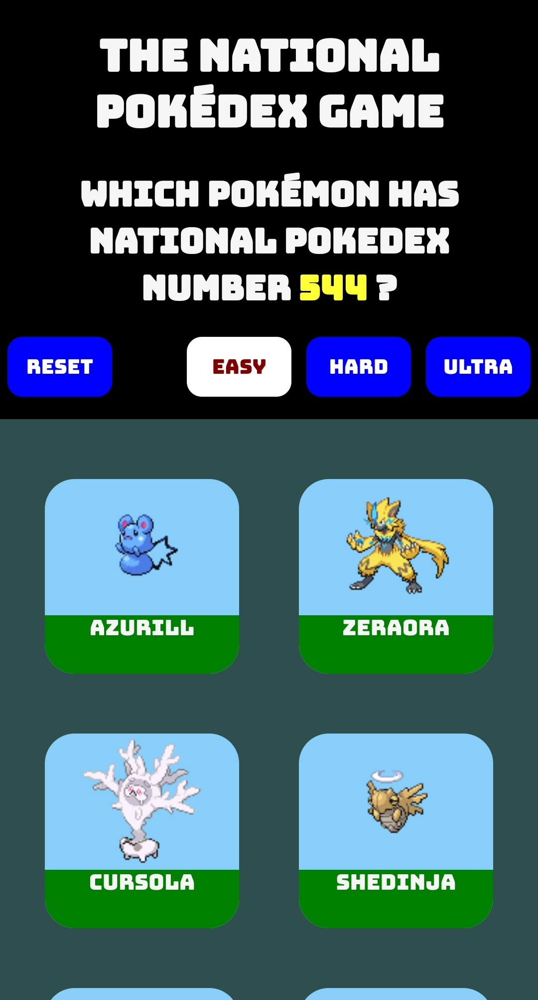

# The National Pokédex Game 🌾

## Background

The JavaScript Color Game is a popular introductory DOM manipulation project. FreeCodeCamp.org have a tutorial on it [here](https://www.freecodecamp.org/news/learn-how-to-manipulate-the-dom-by-building-a-simple-javascript-color-game-1a3aec1d109a/). It's a fun project, and well worth a go if you haven't done it before.

I decided to create a variant of the color game with two core differences from the original:
- It would be a [React.js app](https://github.com/facebook/react) with component based architecture 
- It would use data fetched from the [PokéAPI](https://pokeapi.co/) (a Pokémon API) instead of colors

This game is the outcome. You can play it [here](https://devarrowsmith.github.io/national-pokedex-game/).

---

## Motivation

One week I decided to take a break from work and education. I wanted to create something just for fun. 

The idea of creating a variant of the Color Game using the PokeAPI had been in my mind for a while but it was a low priority project. I decided to implement this as a React app so that I could improve my React skills while making something nice just for me 😊✨

Rather than controlling the UI via direct DOM manipulation this version of the game relies on state updates and component re-renders. In functional terms it's very similar to the JavaScript color game, but in structural terms it's quite different.

---

## Screenshots

---

## Installation

The game is hosted on [GitHub Pages](https://devarrowsmith.github.io/national-pokedex-game/) and can be run from there.

To install the repo locally:
1. [Clone this repo](https://docs.github.com/en/free-pro-team@latest/github/creating-cloning-and-archiving-repositories/cloning-a-repository).
2. Run `npm install` from root.
3. To run the repo locally run `npm start`.

---

## Framework

Built with [React](https://github.com/facebook/react).
Styled with [styled-components](https://styled-components.com/). 

---

## Credits

This application uses Open Source components. You can find the source code of their open source projects along with license information below. Huge thanks to all of the people who contribute to this work ❤️️ 

- Project: [React](https://github.com/facebook/react)  
Copyright (c) Facebook, Inc. and its affiliates.  
License: [MIT](https://github.com/facebook/react/blob/master/LICENSE)

- Project: [styled-components](https://github.com/styled-components/styled-components)  
Copyright (c) 2016-present Glen Maddern and Maximilian Stoiber  
License: [MIT](https://github.com/facebook/react/blob/master/LICENSE)

- Project: [PokéAPI](https://github.com/PokeAPI/pokeapi)   
Copyright (c) © 2013–2020 Paul Hallett and [PokéAPI contributors](https://github.com/PokeAPI/pokeapi#contributing).  
License: [BSD 3-Clause](https://github.com/PokeAPI/pokeapi/blob/master/LICENSE.md)

- **Pokémon and Pokémon character names are trademarks of Nintendo.**

